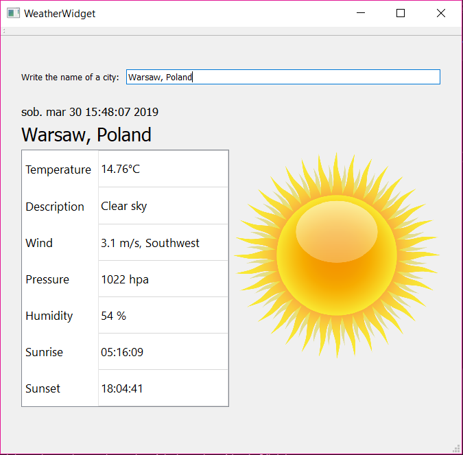

# WeatherWidget
WeatherWidget is a program written in C++ with Qt framework. It allows user to get info about the current weather in over 200 000 cities. The weather data is downloaded from openweathermap.org API. 

## Features
- displays temperature, wind speed, wind direction, pressure and humidity
- displays an image related to the weather conditions and time 
- displays sunrise and sunset times
- provides autocomplete while typing city name

## Releases
[All releases](https://github.com/martalech/WeatherWidget/releases)

## About Project
Written with Visual Studio 2017 with Qt plugin. Compiled with Qt 5.11.1.
